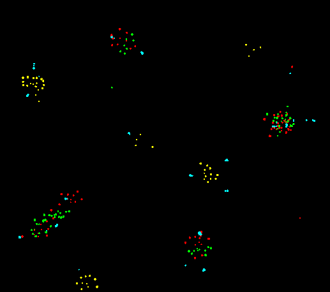
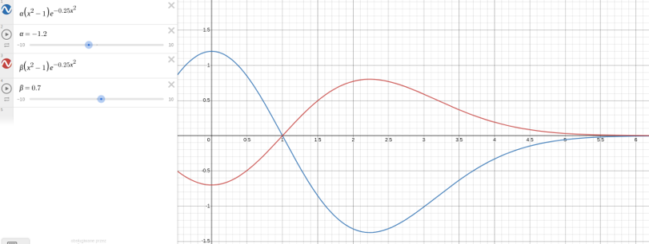
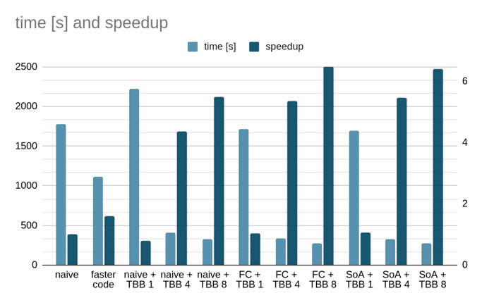
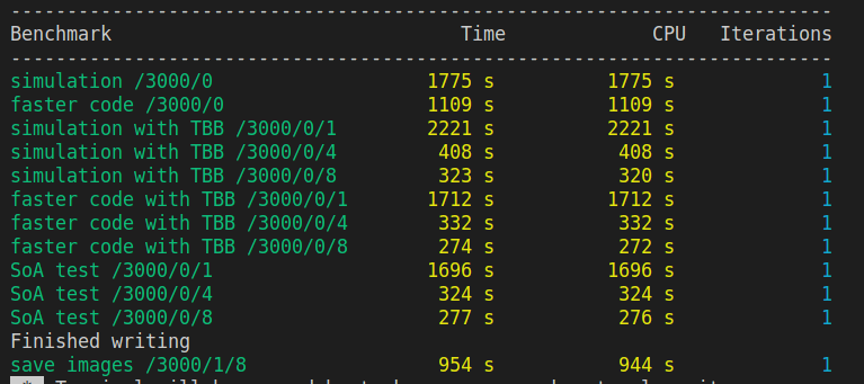

# colision_simulation

Inspired by Game of Life:

https://youtu.be/scvuli-zcRc
 https://youtu.be/0Kx4Y9TVMGg

  Particles have:
  - flavour (type of molecule)
  - mass (some randomness added)
  - radius (depend on mass)
  - force relations between molecules
  - position (2D or 3D)
  - velocity (2D or 3D)
  - force vector (2D or 3D)

   
The force function is a bit complicated but the main equation is like this:
  

 
The alpha coefficient is the force relation between each flavour and defines attraction or repulsion. Additionally, force depends on the mass of both particles. The distance where force is changing direction (x=1 on the scope) is set as proportional to the sum of the radiuses and can be modified in SFML_window class. 
   
Because this system does not preserve Newton's 3rd principle of dynamics and can gain energy from nothing. To reduce this effect drag has been added. The force is proportional to the speed of motion with a sign opposite to the velocity.
  Motion is realized with Newton’s second law: 
  - a=F/m
  - V += a&times;dt
  - X += V&times;dt
  
To speed up the whole simulation multithreading was used (TBB library). Since the problem is O(n^2) or O(0.5&times;n^2) at best code is slow for more than 1k particles. Anyway, the speedup is achieved and that was the main purpose of this challenge. The below data presents results for rendering 5000 frames (O(n) complexity) for 3000 particles (O(n^2) or O(0.5&times;n^2) for "faster code"):

 

 

 
All versions of the simulator produce the same result for given initial conditions. To produce the same initial values of positions, masses etc. rand generator is initiated with the same seed stand(NULL). You can change seed or use the time as the seed to have each time a unique simulation. 

 
For fun, I extended the code into 3D but visualization is still parallel to xy plain so the effects are not that spectacular. 

